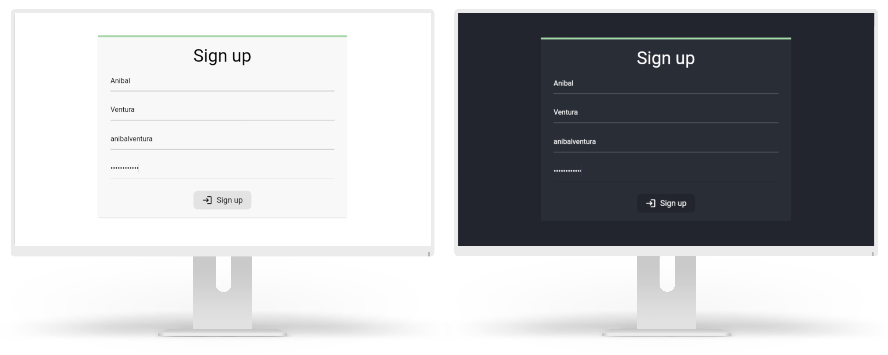

# Sign Form

[](https://flutter.dev/)
[](https://flutter.dev/docs/null-safety)
[]()



Simple web sign form.

## Features

- Progress indicator when fill form.
- Check if all fields are completed.
- Welcome page with logout button.
- Responsive design.
- Dark mode support.

## Dependencies

- [flutter_screenutil](https://pub.dev/packages/flutter_screenutil)
- [google_fonts](https://pub.dev/packages/google_fonts)

# License

```xml
Copyright 2021 Anibal Ventura
```
